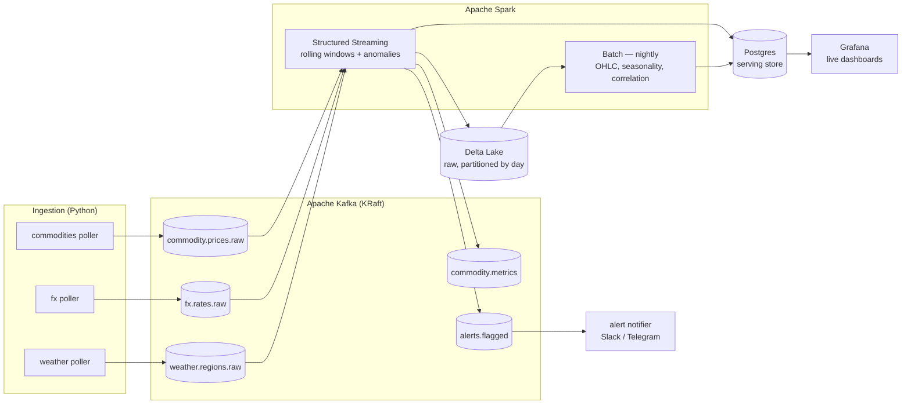

# Ghana Export Commodity & Cedi Monitoring Platform

[](https://github.com/robgotherearly/ghana-export-monitor/actions/workflows/ci.yml)
[](https://github.com/robgotherearly/ghana-export-monitor/actions/workflows/live-sources.yml)

Real-time data engineering on genuinely live, free data: cocoa, gold, crude and the
Ghanaian cedi, streamed through Kafka, processed with Spark, served from Postgres and
rendered on a Grafana dashboard that refreshes itself.

Cocoa and gold are Ghana's #1 and #2 exports and the cedi is live-traded — between them
they largely *are* the Ghanaian economy. Every source in this project is real and
free-tier; **the whole stack runs end to end without a single API key.**

```
docker compose up -d --build     # or: make up
open http://localhost:3000       # Grafana, anonymous access enabled
```

---

## 1. Architecture



The streaming path and the batch path are genuinely separate: Spark Streaming writes
every raw tick to a Delta lake, and the nightly job recomputes the analytical tables
from *that lake*, never from Postgres and never by re-hitting an API. That is what makes
a replay or a backfill possible.

---

## 2. Live data sources

All defaults are key-free. Adding a key just moves a better provider to the front of the
chain — no code changes, no pipeline changes.

| Leg | Default (no key) | What it gives | Upgrades with a key |
|---|---|---|---|
| **Commodities** | Yahoo Finance chart API | Cocoa `CC=F` (ICE), gold `GC=F` (COMEX), WTI `CL=F` (NYMEX) — real exchange quotes, day OHLC | Twelve Data (800/day), API Ninjas, commodities-api |
| **FX / cedi** | open.er-api.com | USD/GHS live, plus EUR/GHS and GBP/GHS derived as crosses | exchangerate.host, Twelve Data (intraday GHS) |
| **Weather** | Open-Meteo | Current temp, humidity, precipitation, wind, cloud, WMO condition for 7 stations — all 7 in one HTTP call | OpenWeatherMap |

Cocoa-belt stations polled: **Kumasi** (Ashanti), **Sefwi Wiawso** (Western North),
**Takoradi** (Western), **Koforidua** (Eastern), **Sunyani** (Bono), **Twifo Praso**
(Central), plus **Accra** as a non-belt reference.

### Honest notes on the data

- **Stooq was the original plan and is not usable.** It now gates its CSV endpoints
  behind a JavaScript proof-of-work bot check. Yahoo's chart endpoint replaced it —
  undocumented but public, no key, real quotes. This is exactly why the provider
  interface exists.
- **Key-free FX refreshes daily, not per second.** open.er-api.com publishes one update
  a day. The rate you see is real; it just is not a tick feed. A Twelve Data key gets
  you intraday GHS.
- **There is a simulated fallback, and it is labelled.** When every live provider for a
  leg fails, the poller random-walks from the *last real print* rather than flat-lining.
  Every such event carries `source="simulated"` and `is_simulated=true` all the way
  through Kafka, Spark, Postgres and the dashboard, and the whole thing switches off
  with `ALLOW_SIMULATED_FALLBACK=false`. Nothing synthetic is ever presented as a live
  quote.

---

## 3. Kafka topic design

| Topic | Partitions | Retention | Key | Contents |
|---|---|---|---|---|
| `commodity.prices.raw` | 3 | 7 days | symbol | Raw cocoa / gold / crude ticks |
| `fx.rates.raw` | 3 | 7 days | pair | GHS cross rates |
| `weather.regions.raw` | 3 | 7 days | region_id | Station readings |
| `commodity.metrics` | 3 | 2 days | symbol | Spark output: rolling stats |
| `alerts.flagged` | 1 | 30 days | entity | Abnormal moves |

Raw and derived topics are kept apart so raw data can be replayed to reprocess without
re-hitting a rate-limited API. Partitioning by symbol / region gives per-entity ordering
and lets consumers scale out. Topics are created explicitly by `scripts/create-topics.sh`
— auto-create would silently hand you one partition and default retention.

---

## 4. Spark Structured Streaming

`streaming/stream_metrics.py` runs six concurrent queries:

| Query | Does |
|---|---|
| `commodity_ticks` | Raw ticks → Delta lake (partitioned by day) + Postgres |
| `commodity_metrics` | 5-min window sliding 1 min → metrics, alerts, weather enrichment |
| `fx_ticks` | Raw cedi rates → lake + Postgres |
| `fx_metrics` | Rolling FX stats + cedi depreciation alerts |
| `weather_readings` | Raw readings → lake + Postgres |
| `weather_metrics` | 15-min tumbling window per region |

Per window it computes moving average, sample stddev, coefficient of variation,
high/low range, % change and a z-score. Three anomaly rules fire from there:

- `price_zscore` — the last price is ≥ 2.5σ from the window mean (needs ≥ 5 ticks)
- `price_jump` — an absolute move of ≥ 1.5% inside one window
- `cedi_depreciation` — the cedi weakens ≥ 0.5% against USD/EUR/GBP inside one window

Alerts land in Postgres **and** are republished to `alerts.flagged`, which the optional
notifier consumes — proving the topic is a real subscription point, not a write-only
sink.

Some deliberate choices worth calling out:

- **`ts_event` is observation time, not the vendor's quote time.** These are polled
  snapshot APIs, not trade feeds. The upstream timestamp is carried separately as
  `ts_source`. If a stale Friday close drove the watermark, the windows would never
  advance and the "live" dashboard would be frozen.
- **first/last within a window come from `min`/`max` over a `(timestamp, value)`
  struct**, not `first()`/`last()`, which have no defined order after a shuffle.
- **Watermark of 2 minutes** bounds the state store while still accepting late ticks.
- **The weather enrichment is a stream-static join** — the latest belt readings are
  re-read from Postgres on every micro-batch and broadcast against the cocoa windows.
  A small, slowly-changing dimension against a fast stream; a stream-stream join here
  would be more state and more fragility for no extra insight.
- **The Postgres sink upserts.** A streaming job re-emits the same open window every
  trigger, so appending would pile up duplicates and overwriting would destroy history.
  `streaming/pg_sink.py` does a partition-wise `INSERT … ON CONFLICT DO UPDATE`, with no
  driver-side `collect()`.

---

## 5. Spark batch — the analytical layer

`batch/daily_batch.py` reads the Delta lake and writes:

- **`daily_ohlc`** — open/high/low/close/avg/stddev per commodity per day
- **`fx_daily`** — the same for each cedi cross
- **`cedi_depreciation`** — 1d / 7d / 30d change plus 7- and 30-day moving averages
- **`cocoa_seasonal`** — monthly cocoa aggregates labelled by Ghanaian cocoa year and
  crop phase (main crop Oct–Mar, light crop Apr–Sep)
- **`weather_price_correlation`** — cocoa price vs. per-region rainfall, temperature and
  humidity on hourly buckets, with the observation count written alongside so a thin
  correlation is visibly thin

Every write is keyed and upserted, and the lake write uses Delta `replaceWhere` so a
re-run replaces exactly the partitions it touched. Run it twice for the same day and the
tables are identical — `market.pipeline_runs` records each attempt.

```bash
make batch                                          # last 30 days
docker compose run --rm spark-batch \
  spark-submit /opt/app/batch/daily_batch.py --date 2026-08-25
```

---

## 6. Dashboards

Grafana provisions two boards from `grafana/dashboards/` (generated by
`scripts/build_dashboards.py`, so panel geometry stays consistent):

**Ghana Live Market Monitor** — refreshes every 10s
- Headline stats: USD/GHS, cocoa, gold, crude, ticks ingested, open alerts
- Live line charts per commodity and all three cedi crosses
- Rolling 5-min % change and a volatility gauge per symbol, straight from Spark
- Z-score chart against the alert threshold
- Alerts table, colour-coded by severity
- Geomap + table of live cocoa-belt weather, and cocoa price vs. belt rainfall

**Ghana Analytical Layer** — the batch output
- Daily OHLC candlesticks for cocoa and gold
- Cedi close with 7/30-day moving averages, and depreciation over 1d/7d/30d
- Cocoa seasonality by crop phase
- Weather/price correlation table and a batch-run audit table

The self-updating dashboard is the visible proof the streaming path is alive.

---

## 7. Quickstart

**Requirements:** Docker Desktop with **at least 5 GB** available to the Linux engine.

The live path alone (Kafka 512 MB heap + Spark driver 1.5 GB + Postgres + Grafana +
three pollers) sits around 3.5 GB. Below ~4 GB it runs, but adding the batch job or
another Compose project on top will wedge the engine.

On Windows the Docker engine runs in WSL2, which defaults to half your RAM. Raise it in
`%UserProfile%\.wslconfig`, then `wsl --shutdown` and restart Docker Desktop:

```ini
[wsl2]
memory=6GB
processors=4
```

Two things worth knowing on a small engine:

- **Don't run the batch job while the streaming job is running.** They are two separate
  JVMs. `docker compose stop spark-streaming`, run `make batch`, then start it again.
- **Stop other Compose projects first.** `docker ps` is the check.

```bash
cp .env.example .env        # optional — every value already has a default
make up                     # or: docker compose up -d --build
make ps
```

| Service | URL |
|---|---|
| Grafana | http://localhost:3000 (`admin`/`admin`, anonymous viewing on) |
| Spark UI | http://localhost:4040 |
| Kafka (host) | `localhost:9092` |
| Postgres | `localhost:5432` — `ghana`/`ghana`, db `ghana_dep` |
| Kafka UI | http://localhost:8080 (`make tools`) — allow ~60s to boot |

First data lands within a poll cycle; the rolling windows need a few minutes of ticks
before the metrics panels fill in.

### Useful commands

### Inspecting the bus

`make tools` starts Kafka UI (http://localhost:8080) and the `alerts.flagged`
notifier. The UI is a Spring Boot app and takes about a minute to bind its port —
connection-refused before then is it still booting, not a broken cluster. It shows
every topic with live message counts, partition leadership, and consumer-group lag,
which is the quickest way to confirm the bus is actually moving data:

```
alerts.flagged            1 partition    34 messages
commodity.metrics         3 partitions 1958 messages
commodity.prices.raw      3 partitions  575 messages
fx.rates.raw              3 partitions 1117 messages
weather.regions.raw       3 partitions  663 messages
```

The notifier registers as consumer group `gdep-alert-notifier`; `make consume` or
the UI's Consumers tab will show it sitting at lag 0 on `alerts.flagged`.

```bash
make dry-run                          # hit every live API once, print to stdout, no Kafka
make test                             # 28 unit tests, no containers needed
make logs / make stream-logs          # tail everything / just Spark
make topics                           # list Kafka topics
make consume TOPIC=alerts.flagged     # read a topic from the CLI
make psql                             # psql into the serving store
make batch                            # run the analytical job now
make tools                            # Kafka UI + the alerts notifier
make cluster                          # a real Spark standalone master + worker
make clean                            # tear down and delete all volumes
```

### Verifying it actually works

```bash
# ticks arriving on the bus
make consume TOPIC=commodity.prices.raw

# Spark writing to the serving store
docker compose exec postgres psql -U ghana -d ghana_dep -c \
  "SELECT symbol, count(*), max(ts_event) FROM market.commodity_ticks GROUP BY 1"

# rolling metrics computed
docker compose exec postgres psql -U ghana -d ghana_dep -c \
  "SELECT symbol, window_start, round(pct_change::numeric,3), round(zscore::numeric,2)
     FROM market.commodity_metrics ORDER BY window_start DESC LIMIT 10"
```

To force an alert without waiting for the market to move, drop the thresholds in `.env`
(`ZSCORE_THRESHOLD=0.5`, `PRICE_JUMP_PCT=0.01`) and `make restart-stream`.

---

## 8. Tech stack

| Layer | Choice | Why |
|---|---|---|
| Ingestion | Python 3.11, `requests`, `confluent-kafka` | Provider chain behind one interface |
| Bus | Apache Kafka 3.8 (KRaft, no ZooKeeper) | Real partitioning, retention, replay |
| Processing | Spark 3.5.3 — Structured Streaming + batch | Windowing, watermarks, stateful ops |
| Lake | Delta Lake 3.2 | Partitioned raw history, `replaceWhere` upserts |
| Serving | Postgres 16 | Simple, Grafana-native, SELECT-only role for the UI |
| Visual | Grafana 11 | Time-series native, provisioned as code, self-refreshing |
| Orchestration | Airflow DAG (optional) or cron | The batch job is a plain `spark-submit` |
| Infra | Docker Compose | One command, sized for an 8 GB laptop |

Spark runs `local[*]` by default to fit a laptop. `make cluster` starts a genuine
standalone master + worker; point `SPARK_MASTER_URL=spark://spark-master:7077` at it and
the same job runs distributed with no code change.

---

## 9. Project layout

```
ingestion/            pollers
  config.py             symbols, cedi pairs, cocoa regions, env config
  models.py             Kafka wire format (one dataclass per topic)
  poller.py             cadence, jitter, provenance, graceful shutdown
  kafka_sink.py         confluent-kafka producer + a stdout sink for --dry-run
  alert_notifier.py     alerts.flagged consumer → Slack / Telegram
  providers/            one module per upstream, chained with fallback
streaming/            Spark Structured Streaming
  stream_metrics.py     the six streaming queries
  pg_sink.py            partition-wise idempotent upsert
  schemas.py            explicit payload schemas
batch/daily_batch.py  nightly analytical job
sql/init/             serving-store schema + read-only Grafana role
grafana/              provisioned datasource and dashboards
scripts/              topic creation, dashboard generator
airflow/dags/         optional nightly DAG
tests/                unit tests, no containers required
```

---

## 10. CI/CD

Three GitHub Actions workflows, in `.github/workflows/`:

**`ci.yml`** — on every push and pull request:

| Job | Checks |
|---|---|
| `quality` | `ruff` lint + the 28 unit tests (no containers needed) |
| `dashboards` | Regenerates the Grafana JSON and fails if the committed files drift from `scripts/build_dashboards.py` |
| `schema` | `docker compose config` validates, and `sql/init` is applied to a real Postgres — asserting the tables and the read-only `grafana_ro` role actually exist, since a failed init script leaves the container up but empty |
| `build` | Builds both images with buildx + GHA layer cache |
| `integration` | Starts Kafka and Postgres, waits on the real healthchecks, creates topics, runs one poller cycle through the actual broker and asserts the messages landed |

The integration job forces the **simulated** provider on purpose: CI must not
fail because someone else's free tier is having a bad morning.

**`live-sources.yml`** — daily at 06:17 UTC, and on demand. Hits the real
upstreams and fails if a leg has no working live provider left. Every event
carries its own provenance, so the check is just "did anything come back with
`is_simulated: false`". Stooq vanished behind a bot check during the build;
this is how you find out next time, instead of from a flat dashboard.

**`release.yml`** — CD. Tagging `v*` builds and pushes both runtime images to
GHCR so a deployment pulls a pinned image rather than rebuilding from source:

```bash
git tag v1.0.0 && git push origin v1.0.0
# -> ghcr.io/robgotherearly/ghana-export-monitor/pollers:1.0.0
# -> ghcr.io/robgotherearly/ghana-export-monitor/spark:1.0.0
```

---

## 11. Where this goes next

- Spark MLlib short-term price model from weather + trend features (the correlation
  table is already the feature source)
- Backfill/replay demo: reset a consumer group and reprocess `*.raw` from offset zero
- Alert delivery is wired (`make tools`); add `SLACK_WEBHOOK_URL` to switch it on
- Swap Postgres for Delta + a query engine if the history outgrows a single node

---

*Scope note: a mobile-money fraud-detection angle was considered and set aside. Ghanaian
transaction-level MoMo data is confidential to the Bank of Ghana and the telcos, with no
public feed — it remains a good **synthetic-data** project, but it could not have been
built on live data the way this can.*
